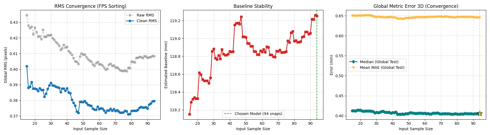
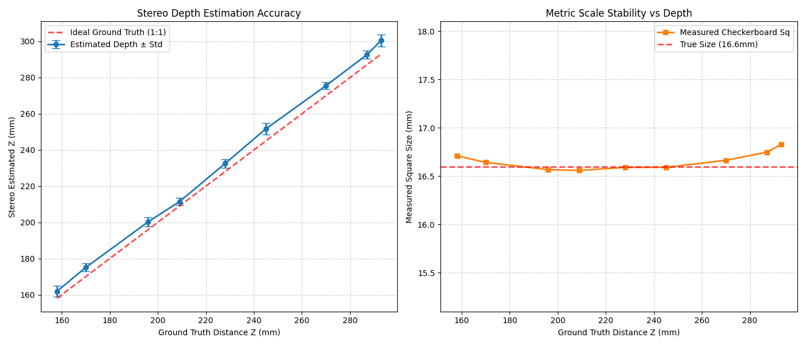

# Towards an Event-Based Stereo Vision System for Water Flow Estimation

This repository contains the source code and experimental results for my Master's Thesis in **Artificial Intelligence and Robotics**. The project focuses on developing a 3D stereo vision system using event-based cameras to monitor and estimate water flow dynamics.

## Hardware Setup
* **Sensors:** 2x Prophesee GenX320 (320x320 resolution).
* **Processor:** Raspberry Pi 5.
* **Synchronization:** Hardware-synced via Master/Slave clock configuration.

---

## 1. Calibration and Stability Analysis
Despite the low spatial resolution of the GenX320 sensors, the system achieves high geometric precision through iterative calibration.

### RMS Reprojection Error
The intrinsic and extrinsic calibration shows asymptotic convergence. The final **Clean RMS** error stabilizes between **0.37 and 0.45 pixels** for both cameras.



### Baseline Stability
The estimated distance between the two cameras (Baseline) stabilizes at approximately **119.2 mm** after 80-90 calibration samples, confirming the structural rigidity of the stereo rig.

---

## 2. Depth Validation
To ensure metric accuracy, the system was tested against known ground truth distances.



* **Linearity:** The Stereo Estimated Z shows a near-perfect linear correlation ($1:1$) with the Ground Truth.
* **Metric Scale:** The measurement of a physical object (16.6 mm) remains consistent across the depth range, with a median error of less than **0.5 mm**.

---

## 3. Spatial Error Distribution
We mapped the 3D reconstruction error across the sensor's Field of View (FOV) to detect any localized distortion.


* **Median Absolute Error:** 0.41 mm.
* **Mean Error:** 0.65 mm.
* **Observations:** The error distribution is highly uniform, with minimal drift at the edges of the FOV, validating the rectification process.

---

## 4. Particle Tracking & Flow Estimation
The core of the system is a 3D particle tracker that processes event clusters (blobs) in real-time.


### Key Features:
* **DipoleBondManager:** Matches positive and negative event clusters using the Hungarian Algorithm for precise centroid localization.
* **Kalman Filtering:** A 9-state Kalman Filter tracks each particle's position, velocity, and acceleration in 3D space.
* **Flow Statistics:** The system automatically generates velocity histograms and global flow direction vectors (e.g., Mean Global Flow Direction: **282.0°** at **0.07 m/s**).

---

## How to Run
To record a new session with custom naming:
```bash
python record_stereo.py --exp nome_esperimento --id 1
